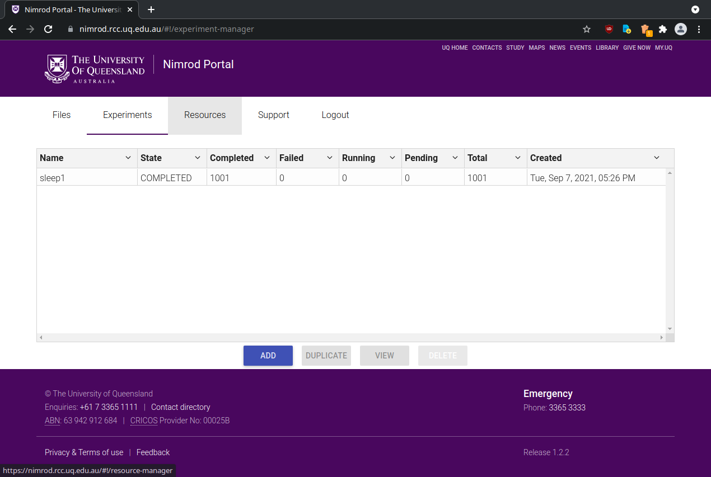

# Nimrod Portal Terraform Deployment

## Instructions

1. Source your OpenStack RC file
2. Update modules and init Terraform
   ```
   $ git submodule update --init
   $ terraform init
   ```
3. Make sure your kubeconfig is configured with three contexts:
   * `rcc-k8s-dev`
   * `rcc-k8s-test`
   * `rcc-k8s-prod`
4. Set `KUBE_CONFIG_PATH` to the path of your kubeconfig
5. Switch terraform workspace
   ```
   $ terraform workspace select {dev,test,prod}
   ```
6. Configure secrets. See `secrets.example.tfvars` for a template.
7. Apply!
   ```
   $ terraform apply -var-file=secrets.tfvars
   ```

## Building images

Images are built using [Nix](https://nixos.org/download.html):

```
$ git clone https://github.com/UQ-RCC/rcc-nix.git
$ cd rcc-nix
$ docker load < $(nix-build -A containers.container-name)
```

`container-name` may be substituted with one of the following:

* `nimrod-portal`
* `nimrod-portal-maint`
* `nimrod-portal-backend`
* `portal-client`
* `portal-resource-server`

## Screenshot



## License
This project is licensed under the [Apache License, Version 2.0](https://opensource.org/licenses/Apache-2.0):

Copyright &copy; 2021 [The University of Queensland](http://uq.edu.au/)

Licensed under the Apache License, Version 2.0 (the "License");
you may not use this file except in compliance with the License.
You may obtain a copy of the License at

    http://www.apache.org/licenses/LICENSE-2.0

Unless required by applicable law or agreed to in writing, software
distributed under the License is distributed on an "AS IS" BASIS,
WITHOUT WARRANTIES OR CONDITIONS OF ANY KIND, either express or implied.
See the License for the specific language governing permissions and
limitations under the License.
